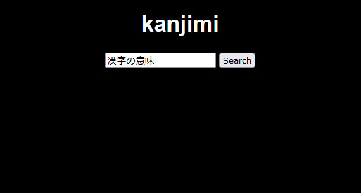
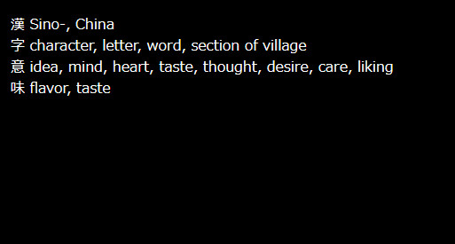

# kanjimi
kanjimi is a dictionary web app where the user can input a Japanese word or sentence and find all the kanji contained in the query and their meanings. This can be useful for better understanding the meaning of a Japanese word, or it's composition. The app can be used on its own, or embedded into Anki cards.




# Dependencies
- flask
- KANJIDIC (can be obtained from https://www.edrdg.org/wiki/index.php/KANJIDIC_Project)

# Usage
The app can be launched from the command-line with the KANJIDIC file provided as an argument:
```sh
$ kanjimi.py -k kanjidic
```

# Embedding into Anki
The app can be embedded into an Anki card template by using an \<iframe\> tag and inserting the desired field into the URL:
```html
<iframe src="http://127.0.0.1:9019/search?q={{Expression}}" width="750" height="250" frameBorder="0"></iframe>
```
